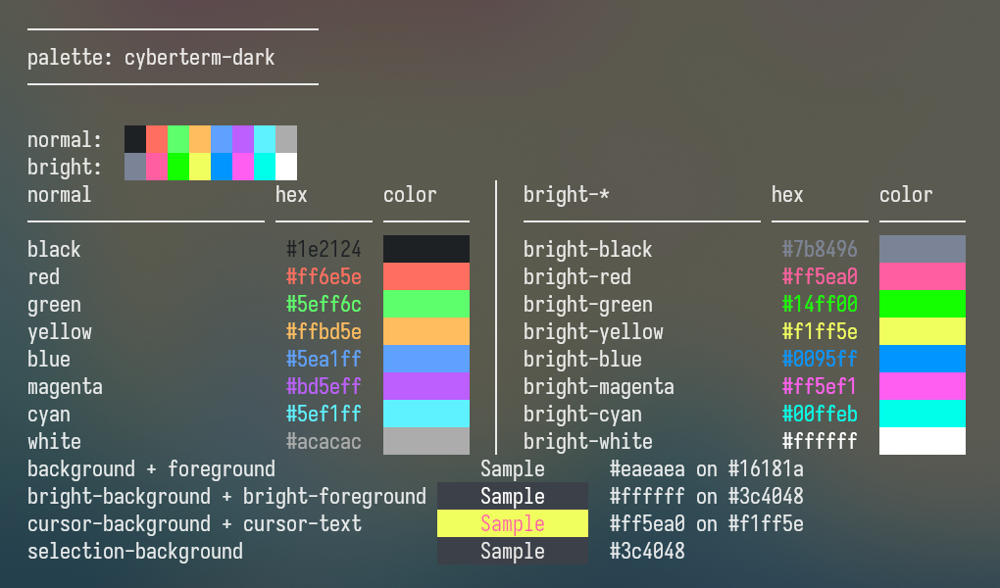
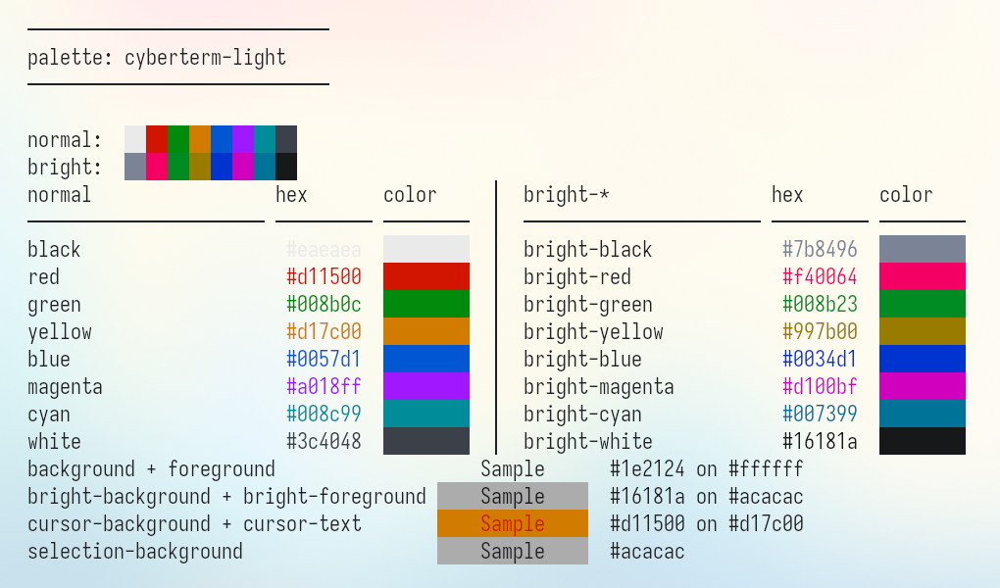

# ᴄʏʙᴇʀᴛᴇʀᴍ

**cyberterm** is a fully fleshed-out 16-color terminal palette, inspired by the excellent [cyberdream.nvim](https://github.com/scottmckendry/cyberdream.nvim) Neovim theme.

While the upstream `cyberdream.nvim` theme is beautiful, its provided terminal configurations typically only define 8 basic colors, which falls short of a complete 16-color ANSI environment.

**cyberterm** bridges this gap by focusing on the color palette itself. It expands the original colors into a complete, harmonious 16-color ANSI palette (both normal and bright variants). For convenience, ready-to-use configurations for several popular terminal emulators are also included out-of-the-box.

## 📸 Screenshots

| Dark Mode | Light Mode |
| :---: | :---: |
|  |  |

## ✨ Features

- **Full 16-Color Palette**: Expands the original 8-color terminal config into a complete 16-color ansi palette.
- **Color Philosophy**: The design principle strictly maximizes the use of the original upstream colors to maintain authentic aesthetic harmony. New colors are dynamically generated (e.g., via HSV transformations like hue shifting and maximizing saturation) only to fill the missing or unsuitable slots in the 16-color palette.
- **Cyber-Flavored Cursors**: The cursor colors have been meticulously tweaked to give your terminal a more authentic "cyber" feel.
  - *Dark Mode*: Striking Yellow cursor with Pink text.
  - *Light Mode*: Vibrant Orange cursor with Red text.
- **Dark & Light Variants**: Full support for both dark and light modes.
- **Multi-Terminal Support**: Out-of-the-box configurations for popular terminal emulators.

## 💻 Terminal Configurations

You can find the ready-to-use configuration files for your favorite terminal emulator in the root of this repository:

- **Alacritty**: [Dark](./cyberterm-dark-alacritty.toml) / [Light](./cyberterm-light-alacritty.toml)
- **Kitty**: [Dark](./cyberterm-dark-kitty.conf) / [Light](./cyberterm-light-kitty.conf)
- **Konsole**: [Dark](./cyberterm-dark-konsole.colorscheme) / [Light](./cyberterm-light-konsole.colorscheme)
- **Windows Terminal**: [Dark](./cyberterm-dark-wt.json) / [Light](./cyberterm-light-wt.json)

*(Missing your favorite terminal? PRs to add new configurations are always welcome!)*

## 🎨 Palette

### 🌙 Dark Mode

#### ANSI Colors

| Color | Normal | Bright |
| :--- | :--- | :--- |
| **Black** |  `#1e2124` |  `#7b8496` |
| **Red** |  `#ff6e5e` |  `#ff5ea0` |
| **Green** |  `#5eff6c` |  `#14ff00` |
| **Yellow** |  `#ffbd5e` |  `#f1ff5e` |
| **Blue** |  `#5ea1ff` |  `#0095ff` |
| **Magenta** |  `#bd5eff` |  `#ff5ef1` |
| **Cyan** |  `#5ef1ff` |  `#00ffeb` |
| **White** |  `#acacac` |  `#ffffff` |

#### Terminal Colors

| Element | Color |
| :--- | :--- |
| **Background** |  `#16181a` |
| **Foreground** |  `#eaeaea` |
| **Bright Background** |  `#3c4048` |
| **Bright Foreground** |  `#ffffff` |
| **Selection Background** |  `#3c4048` |
| **Cursor Background** |  `#f1ff5e` |
| **Cursor Text** |  `#ff5ea0` |

### ☀️ Light Mode

#### ANSI Colors

| Color | Normal | Bright |
| :--- | :--- | :--- |
| **Black** |  `#eaeaea` |  `#7b8496` |
| **Red** |  `#d11500` |  `#f40064` |
| **Green** |  `#008b0c` |  `#008b23` |
| **Yellow** |  `#d17c00` |  `#997b00` |
| **Blue** |  `#0057d1` |  `#0034d1` |
| **Magenta** |  `#a018ff` |  `#d100bf` |
| **Cyan** |  `#008c99` |  `#007399` |
| **White** |  `#3c4048` |  `#16181a` |

#### Terminal Colors

| Element | Color |
| :--- | :--- |
| **Background** |  `#ffffff` |
| **Foreground** |  `#1e2124` |
| **Bright Background** |  `#acacac` |
| **Bright Foreground** |  `#16181a` |
| **Selection Background** |  `#acacac` |
| **Cursor Background** |  `#d17c00` |
| **Cursor Text** |  `#d11500` |

## 🪄 How It Works

The magic behind the color palette generation is defined in [`spec.yml`](./spec.yml). You can inspect this file to see exactly how the base colors from `cyberdream` are mapped and how the missing colors are generated via color space transformations (`rgb-to-hsv` -> `hue shift` -> `sat-set-max` -> `hsv-to-rgb`).

The repository also includes a `show_colors.py` script, which is used to preview and process these colors.

## 📜 License

This project is open-source and free to use. See the [LICENSE](LICENSE) file for details. Enjoy your new cyberpunk terminal experience!
